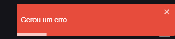
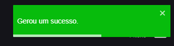

## React Toastify Setup

1. `yarn add react-toastify`

<hr>

2. App.js

```
import { ToastContainer } from 'react-toastify';

function App() {
  return (
    <>
      <Routes />
      <ToastContainer autoClose={3000} /> // time to close de alert
    </>
  )
}
```

3. style.js
<pre>
import 'react-toastify/dist/ReactToastify.css';
</pre>

4. randomPageToAddToastify.js

<pre>
import { toast } from 'react-toastify';

function doSomething(a) {
  if(a === 1) {
    toast.error('Gerou um erro.')
  }

  if(a === 2) {
    toast.success('Gerou um sucesso.')
  }
}
</pre>

```
<button onClick={() => doSomething(1)}>Press Here</button>
```



