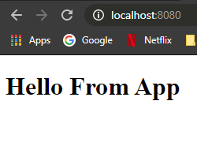

# How to create an React App from scratch!

### 1) Create package.json file inside a proper directory.

`yarn init -y`

### 2) Install all the needing dependencies.

#### devDependencies

`yarn add @babel/core @babel/preset-env @babel/preset-react babel-loader webpack webpack-cli webpack-dev-server style-loader css-loader file-loader @babel/plugin-proposal-class-properties -D`

#### dependencies

`yarn add react react-dom`

### Directory structure

<pre>
|- ReactApp
  |- node_modules
  |- public
    |- index.html
  |- src
    |- App.js
    |- index.js
  |- babel.config.js
  |- package.json
  |- webpack.config.js
  |- yarn.lock
</pre>

### 3) babel.config.js

<pre>
module.exports = {
  presets: [
    "@babel/preset-env", // make JS features understandable for the browser.
    "@babel/preset-react" // make JSX understandable for the browser.
  ],
  plugins: [
    '@babel/plugin-proposal-class-properties'
  ],
} 
</pre>

### 4) webpack.config.js

<pre>
// responsible to make the bundle file 
const { resolve } = require("path");

module.exports = {
  entry: resolve(__dirname, "src", "index.js"),
  output: {
    path: resolve(__dirname, "public"),
    filename: "bundle.js",
  },
  devServer: {
    contentBase: resolve(__dirname, "public"),
  },
  module: {
    rules: [
      {
        test: /\.js$/,
        exclude: /node_modules/,
        use: {
          loader: "babel-loader",
        },
      },
      {
        test: /\.css$/,
        use: [{ loader: "style-loader" }, { loader: "css-loader" }],
      },
      {
        test: /.*\.(gif|png|jpe?g)$/i,
        use: {
          loader: "file-loader",
        },
      },
    ],
  },
};
 
</pre>

### 5) package.json

<pre>
  "scripts": {
    build: "webpack --mode development",
    "dev": "webpack-dev-server --mode development"
  }
</pre>

## Now all you need to do is run the following command:

`yarn build`

#### that should create a file called bundle.js - public/bundle.js

## Now it's time to make our React components

### 6) index.html

```
<!DOCTYPE html>
<html lang="en">
  <head>
    <meta charset="UTF-8" />
    <meta name="viewport" content="width=device-width, initial-scale=1.0" />
    <title>ReactJS</title>
  </head>
  <body>
    <div id="root"></div>

    <script src="./bundle.js"></script>

  </body>
</html>
```

### 7) src/index.js

<pre>
import React from "react";
import { render } from "react-dom";
import App from "./App";

render(<App />, document.getElementById("root"));
</pre>

### 8) src/App.js

```
import React from "react";

export default function App() {
return (
<div>
<h1>Hello From App</h1>
</div>
);
}
```

### All Done just one last command

`yarn dev`

### Now open your browser in the following URL

#### http://localhost:8080

### And you should get something like that


