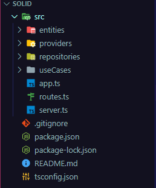

## Criando uma API utilizando os princípios de SOLID.

<p>[S]ingle Responsibility Principle (Princípio da Responsabilidade Única)</p>
<p>[O]pen/Closed Principle (Princípio do Aberto/Fechado)</p>
<p>[L]iskov Substitution Principle (Princípio da Substituição de Liskov)</p>
<p>[I]nterface Segregation Principle (Princípio da Segregação de Interfaces)</p>
<p>[D]ependency Inversion Principle (Princípio da Inversão de Dependências)</p>
<hr />

## Criação do Projeto
#

```
npm i express
npm i typescript ts-node-dev -D
npx tsc --init
```
*script para rodar o app*
```
"scripts": {
    "start": "tsnd --transpile-only --respawn --ignore-watch node_modules src/server.ts"
  }
```

## Estrututa do Projeto.
#



**entities:** Entidades presentes na aplicação. obs: nem sempre são relacionadas ao banco de dados.

**providers:** Para comunicação com API's externas.

**repositories:** Comunicação entre as funcionalidades(useCases) e o banco de dados.

**useCases:** Ações que o usuário pode realizar (CRUD).