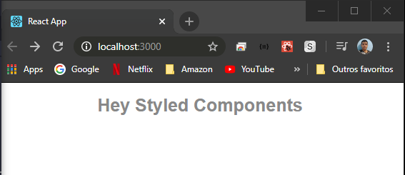

# Styled-Components setup and usage

1. First you need to install the package:
   `yarn add styled-components`

2. The usage.

```
import React from 'react';
import styled from 'styled-components';

const App = () => <Title>Hey Styled Components</Title>;

const Title = styled.h1`
  font-size: 25px;
  text-align: center;
  color: #888;
  font-family: Arial, Helvetica, sans-serif;
`;

export default App;
```



#### You can as well separate in another file like that:

<pre>
|- App
  |- App.js
  |- styles.js
</pre>

1. App.js

```
import React from 'react';
import { Title } from './styles.js'

const App = () => <Title>Hey Styled Components</Title>;

export default App;
```

2. styles.js

```
import styled from 'styled-components';

export const Title = styled.h1`
  font-size: 25px;
  text-align: center;
  color: #888;
  font-family: Arial, Helvetica, sans-serif;
`;

```

#### Same result.
